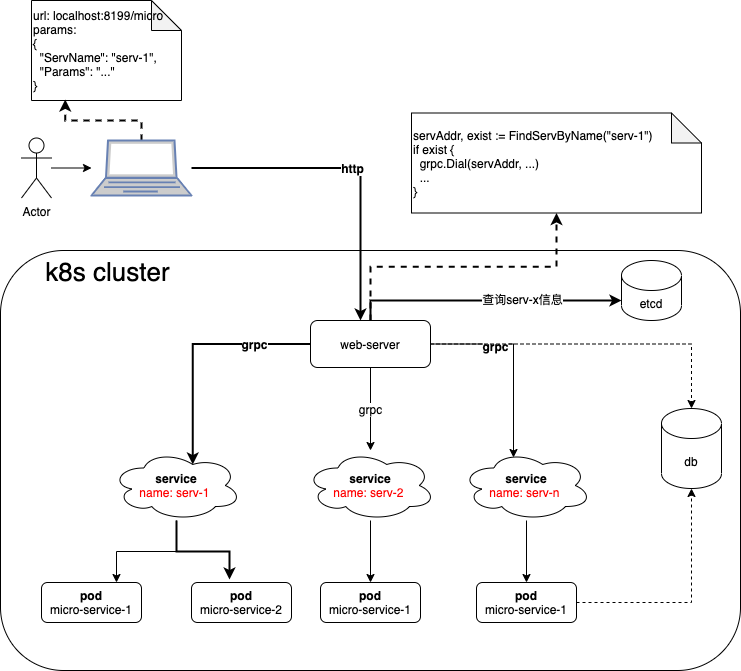

# 概要



# 目的
在不修改http-server路由的前提下，通过新增微服务对功能进行扩展

# 目录说明
| 目录 | 描述 |
| --- | --- |
| gateway | 启动http server，并将路由转发给相应的grpc微服务|
| serv-1 | 微服务，处理具体功能|
| serv-2 | 微服务，处理具体功能|
| protobuf | gprc通信协议|


# 流程说明
* 用户通过浏览器提交所需服务的名称以及服务所需参数等信息，发送到http server；如图中所示，用户需要"serv-1"提供服务
* grpc-gateway通过路由参数，获取微服务名，然后通过grpc将消息转发给微服务
* 微服务处理完后，将结果通过grpc返回给http server

# 优势说明
* 依托k8s，可以很容易实现服务横向扩展；同时，k8s的service提供了负载均衡
* 新功能的添加不需要修改grpc-gateway, grpc-gateway不感知任何新功能的添加，只负责转发
* 微服务进行新功能处理，如果出现异常，不会影响其他功能模块。  

# 执行
* 启动 gateway
```
$ cd gateway
$ go build .
$ ./gateway
```
* 启动 serv-1
```
$ cd serv-1
$ go build .
$ ./serv-1
```
* 启动 serv-2
```
$ cd serv-2
$ go build .
$ ./serv-2
```
