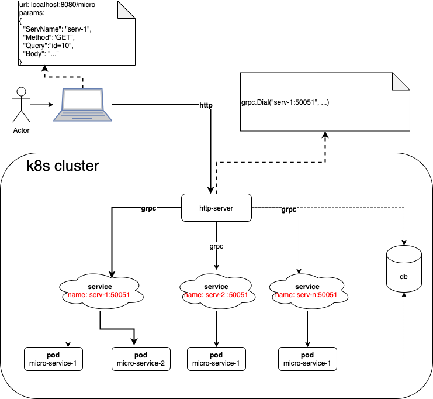

# 概要


# 目的
在不修改http-server路由的前提下，通过新增微服务对功能进行扩展

# 流程说明
* 用户通过浏览器提交所需服务的名称以及服务所需参数等信息，发送到web server；如图中所示，用户需要"serv-1"提供服务
* web server通过k8s查询label为 serv-1的服务，发现有该服务，则通过grpc调用该服务进行处理
* 微服务处理完后，将结果通过grpc返回给web server

# 优势说明
* 依托k8s，可以很容易实现服务横向扩展；同时，k8s的service提供了负载均衡
* 新功能的添加不需要修改web server，web server不感知任何新功能的添加，只负责转发
* 微服务进行新功能处理，如果出现异常，不会影响其他功能模块。（即，web server不受影响，其他功能模块可以正常运行）

# demo
## 目录说明
| 目录 | 描述 |
| --- | --- |
| web-server | web服务器，服务与用户进行交互（goframe）|
| serv-1 | 微服务，处理具体功能|
| serv-2 | 微服务，处理具体功能|
| protobuf | gprc通信协议|

# 执行
* 启动web-server
```
$ cd web-server
$ ./web-server
```
* 启动 micro-serv-1
```
$ cd serv-1
$ ./serv-1
```
* 启动 micro-serv-2
```
$ cd serv-2
$ ./serv-2
```

* postman发送消息

